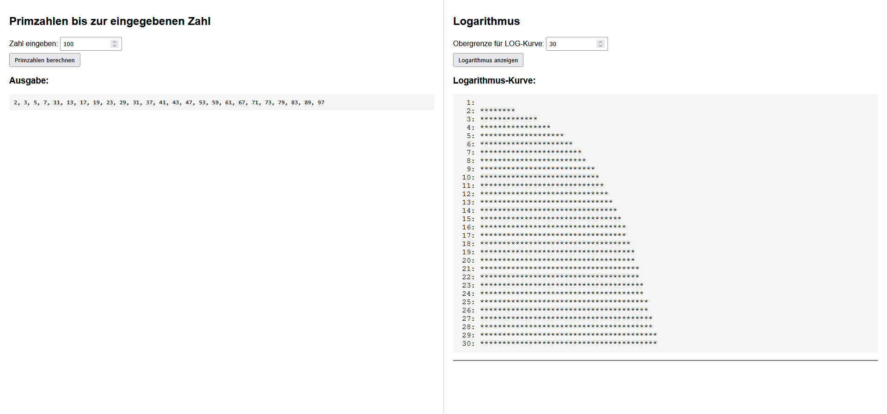

# Logarithmus & Primzahlen Visualizer

Dieses einfache Web-Tool visualisiert zwei grundlegende mathematische Konzepte: die **Primzahlen** bis zu einer eingegebenen Grenze und die Form einer **Logarithmuskurve** ($\log_{10}(x)$) als Sternchendiagramm.



## Funktionen

* **Primzahlrechner:** Berechnet und listet alle Primzahlen bis zu einer frei wählbaren Obergrenze auf (siehe linke Seite des Screenshots).
* **Logarithmus-Visualisierung:** Stellt die Zunahme des dekadischen Logarithmus ($\log_{10}$) von $1$ bis zu einer definierten Obergrenze dar. Die Länge der Sternchen (\*) repräsentiert den logarithmischen Wert (**Logarithmus-Kurve** auf der rechten Seite des Screenshots).

## Technologie

Die Anwendung ist in reinem **HTML, CSS und JavaScript** implementiert.

## Fucntion block ()

Die folgende Codezeile zeigt die JavaScript-Funktion `zeigeLog()`, die die Logarithmus-Kurve generiert:

```javascript
function zeigeLog() {
    const limit = parseInt(document.getElementById("logLimit").value);
    const out = document.getElementById("logOutput");

    let txt = "";
    const maxStars = 40;
    const maxLog = Math.log10(limit <= 1 ? 2 : limit);

    for (let i = 1; i <= limit; i++) {
        const logVal = Math.log10(i);
        const stars = Math.round((logVal / maxLog) * maxStars);
        txt += i.toString().padStart(3) + ": " + "*".repeat(stars) + "\n";
    }

    out.textContent = txt;
}
